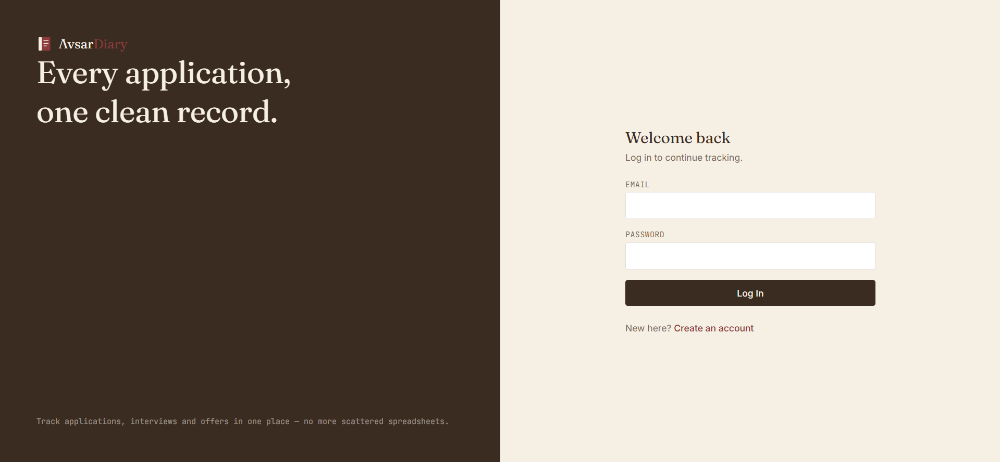
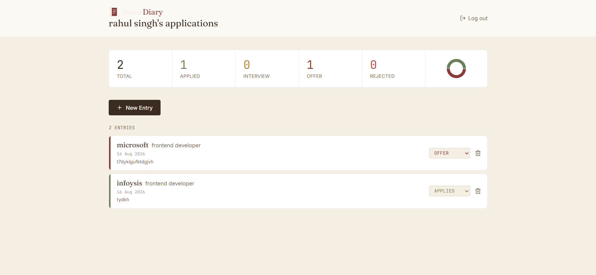

# 📔 AvsarDiary — Job Application Tracker

A full-stack MERN application to track job applications, interviews, and offers in one clean, organized dashboard — built to replace scattered spreadsheets with a single source of truth for your job search.

**🔗 Live Demo:** [job-tracker-delta-ivory.vercel.app](https://job-tracker-delta-ivory.vercel.app)
**🔗 API:** [avsardairy-api.onrender.com](https://avsardairy-api.onrender.com)

> ⚠️ The backend is hosted on Render's free tier, which sleeps after inactivity. The first request after idle time may take 30–50 seconds to respond.

---

## ✨ Features

- 🔐 **Secure Authentication** — JWT-based signup/login with bcrypt password hashing
- 📋 **Full CRUD** — Add, view, update, and delete job applications
- 🔒 **Data Isolation** — Each user can only access their own application data (enforced at the API level, not just the UI)
- 📊 **Visual Dashboard** — Status breakdown with a live donut chart and stat counters
- 🏷️ **Status Tracking** — Applied → Interview → Offer → Rejected, updatable inline
- 📱 **Responsive Design** — Works cleanly on mobile and desktop
- 🎨 **Custom Design System** — Distinct visual identity (serif + monospace typography, custom color palette) instead of default component-library styling

---

## 🛠️ Tech Stack

**Frontend**
- React 18 + Vite
- Tailwind CSS v4
- React Router DOM
- Axios
- Recharts (data visualization)
- Lucide React (icons)

**Backend**
- Node.js + Express.js
- MongoDB Atlas + Mongoose
- JWT (jsonwebtoken) for authentication
- bcryptjs for password hashing

**Deployment**
- Frontend → Vercel
- Backend → Render
- Database → MongoDB Atlas

---

## 📸 Screenshots

<!-- Add screenshots here — see instructions below -->
| Login | Dashboard |
|---|---|
|  |  |

---

## 🏗️ Architecture

```
Client (React)  ─────HTTP/JWT─────▶  Server (Express)  ─────Mongoose─────▶  MongoDB Atlas
   Vercel                                Render
```

- All protected routes require a valid JWT sent via the `Authorization: Bearer <token>` header
- A custom Express middleware verifies the token and attaches the authenticated user to each request before it reaches any controller
- Every database query is scoped to `req.user._id`, so no user can read or modify another user's data even if they guess a valid job ID

---

## 📂 Project Structure

```
Job-Tracker/
├── client/                    # React frontend
│   ├── src/
│   │   ├── components/        # JobForm, JobCard, Logo
│   │   ├── pages/             # Login, Signup, Dashboard
│   │   ├── context/           # AuthContext (global auth state)
│   │   └── services/          # api.js (Axios instance + interceptors)
│   └── package.json
│
├── server/                    # Node/Express backend
│   ├── models/                # User.js, Job.js (Mongoose schemas)
│   ├── routes/                # authRoutes.js, jobRoutes.js
│   ├── controllers/           # authController.js, jobController.js
│   ├── middleware/            # authMiddleware.js (JWT verification)
│   ├── config/                # db.js (MongoDB connection)
│   └── server.js
│
└── README.md
```

---

## 🚀 Running Locally

### Prerequisites
- Node.js (v18+)
- A MongoDB Atlas account (free tier works)

### 1. Clone the repo
```bash
git clone https://github.com/thakurrahul99/Job-Tracker.git
cd Job-Tracker
```

### 2. Backend setup
```bash
cd server
npm install
```

Create a `.env` file in `/server`:
```
MONGO_URI=your_mongodb_connection_string
JWT_SECRET=your_random_secret_key
PORT=5000
```

Run the server:
```bash
npm run dev
```

### 3. Frontend setup
```bash
cd ../client
npm install
```

Create a `.env` file in `/client`:
```
VITE_API_URL=http://localhost:5000/api
```

Run the frontend:
```bash
npm run dev
```

The app will be available at `http://localhost:5173`.

---

## 🔑 API Endpoints

| Method | Endpoint | Description | Auth Required |
|---|---|---|---|
| POST | `/api/auth/signup` | Register a new user | ❌ |
| POST | `/api/auth/login` | Log in and receive a JWT | ❌ |
| GET | `/api/jobs` | Get all jobs for the logged-in user | ✅ |
| POST | `/api/jobs` | Create a new job application | ✅ |
| PUT | `/api/jobs/:id` | Update a job application | ✅ |
| DELETE | `/api/jobs/:id` | Delete a job application | ✅ |

---

## 🗺️ Roadmap

- [ ] Email reminders for follow-ups (Nodemailer)
- [ ] Resume/cover letter file upload per application
- [ ] Kanban-style drag-and-drop board view
- [ ] CSV export of application history

---

## 👤 Author

**Rahul Singh**
MERN Stack Developer
- GitHub: [@thakurrahul99](https://github.com/thakurrahul99)
- LinkedIn: [rahulsinghdev](https://www.linkedin.com/in/rahulsinghdev/)
- Portfolio: [portfolio-vxax.vercel.app](https://portfolio-vxax.vercel.app/)
